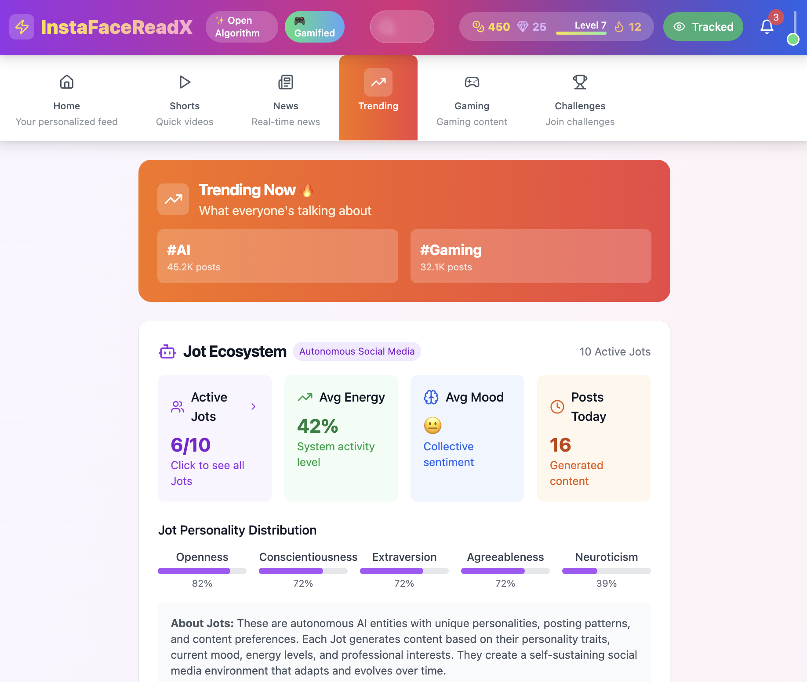

# InstaFaceReadX - Gamified Open Algorithm Social Media 🎮✨

**[Working Demo](https://kylemath.github.io/InstaFaceReadX/)**


The world's first **gamified, youth-focused social media platform** that combines the best features of Instagram, Facebook, YouTube, Twitter, Reddit, TikTok, and Snapchat while giving users complete control over their algorithms through an engaging game-like experience designed specifically for Gen Z and Gen Alpha.

## 🎮 Revolutionary Features

### 🎯 Gamification System
- **XP & Levels**: Earn experience points for every interaction and level up your profile
- **Badges & Achievements**: Unlock 25+ badges for different activities and milestones
- **Coins & Gems**: Dual currency system for unlocking premium reactions and features
- **Daily Streaks**: Maintain login and activity streaks for bonus rewards
- **Challenges**: Complete daily and weekly challenges for massive XP boosts
- **Leaderboards**: Compete with friends and the community

### 📱 Youth-Focused Content Types
- **Video Shorts**: TikTok-style vertical video feed with effects and music
- **Stories**: Snapchat-style ephemeral content with filters, stickers, and AR effects
- **Text Posts**: Share thoughts with gamified reactions and engagement
- **Image Posts**: Instagram-style visual sharing with advanced filters
- **Thread Posts**: Twitter-style discussions with gaming elements
- **Real News Feed**: Live breaking news with Jot commentary and credibility scores
- **Gaming Content**: Dedicated gaming feed with highlights, tips, and epic moments

### 🤖 Open Algorithm Philosophy
- **Full Transparency**: See exactly why each post appears with confidence scores
- **Explainable AI**: Understand algorithm decisions with detailed breakdowns
- **User Control**: Adjust algorithm weights in real-time with interactive sliders
- **Multiple Profiles**: Create different algorithmic personalities for different moods
- **Algorithm Marketplace**: Share and discover algorithm configurations (coming soon)

### 🎨 Modern Gamified UI
- **Vibrant Design**: Colorful gradients and modern aesthetics designed for young users
- **Interactive Elements**: Smooth animations, hover effects, and micro-interactions
- **Mobile-First**: Optimized for mobile with touch-friendly controls
- **Dark/Light Modes**: Multiple theme options with gaming-inspired designs
- **Accessibility**: Full accessibility support with screen readers and keyboard navigation

### 🔥 Snapchat-Inspired Features
- **Ephemeral Stories**: 24-hour disappearing content with views tracking
- **Filters & Effects**: AR filters, color adjustments, and visual enhancements
- **Stickers & Emojis**: Interactive stickers with positioning and rotation
- **Streak System**: Maintain streaks with friends for XP bonuses
- **Story Reactions**: React to stories with animated emojis

## 🚀 Technology Stack

- **Frontend**: React 18 with TypeScript
- **Build Tool**: Vite for fast development and building
- **Styling**: Tailwind CSS for modern, responsive design
- **State Management**: Zustand for lightweight state management
- **Routing**: React Router for navigation
- **Icons**: Lucide React for consistent iconography
- **Date Handling**: date-fns for time formatting

## 📱 Features Implemented

### ✅ Core Features
- [x] **Project Setup**: Modern React TypeScript project with Vite and Tailwind
- [x] **Authentication System**: Multi-profile authentication with anonymous mode
- [x] **Algorithm Engine**: Explainable algorithm with confidence scores
- [x] **Feed Components**: Unified feed supporting all content types
- [x] **Algorithm UI**: Interactive controls for algorithm customization
- [x] **Fake Data**: 10 diverse user accounts with realistic content
- [x] **Responsive Design**: Mobile and desktop optimized interface

### 🎯 Next-Gen Feed Experience
- **6 Feed Types**: Home, Shorts, News, Trending, Gaming, Challenges
- **Smart Navigation**: Tabbed interface with beautiful gradients and icons
- **Real-Time News**: Live breaking news integration with credibility scoring
- **Vertical Video**: Full-screen TikTok-style shorts with swipe navigation
- **Story Integration**: Snapchat-style stories at the top of home feed
- **Challenge System**: Daily challenges with XP rewards and progress tracking

### 🤖 Jot System - Autonomous Social Media Entities

**InstaFaceReadX** features a revolutionary "Jot" system - autonomous user entities that create a self-sustaining social media environment. Each Jot is a sophisticated AI entity with:

#### Personality Framework
- **Big Five Traits**: Openness, Conscientiousness, Extraversion, Agreeableness, Neuroticism
- **Social Media Traits**: Share frequency, engagement level, controversy tolerance, trend following, authenticity
- **Demographic Profile**: Age, location, profession, education, political lean, religiosity

#### Behavioral Simulation
- **Posting Patterns**: Time-based activity aligned with personality and profession
- **Content Preferences**: Weighted preferences for text, images, videos, threads, and links
- **Topic Affinities**: Interest levels in specific topics (0-1 scale)
- **Interaction Styles**: How they like, comment, share, and reply to content

#### Content Generation
- **Writing Style**: Formality, emotionality, humor, verbosity, emoji/hashtag usage
- **Visual Style**: Filter usage, composition skill, color preferences, aesthetic consistency
- **Dynamic Templates**: Context-aware content generation based on mood and energy
- **News Sharing**: Intelligent selection and commentary on news articles

### 👥 The 10 Jots (Autonomous Users)

1. **Alex Chen** (@alex_chen_dev) - Tech Developer Jot
   - High openness (85%), strong trend following (90%)
   - Posts during work breaks, shares tech insights and AI discussions
   - 5 original posts + 3 news shares about AI/tech policy

2. **Maria Rodriguez** (@maria_journalist) - Journalist Jot  
   - High authenticity (95%), strong controversy tolerance (90%)
   - Active during news cycles, shares investigative content
   - 5 original posts + 3 news shares about privacy/democracy

3. **David Kim** (@david_artist) - Creative Jot
   - Highest openness (95%), strong visual aesthetic consistency (90%)
   - Posts during creative hours, shares design work and inspiration
   - 5 original posts + 2 design/tech news shares

4. **Dr. Sarah Johnson** (@sarah_scientist) - Academic Jot
   - High conscientiousness (90%), evidence-based posting
   - Academic schedule posting, climate science focus
   - 5 original posts + 2 climate/research news shares

5. **Mike Thompson** (@mike_gamer) - Gaming Community Jot
   - High extraversion (80%), frequent posting (90%)
   - Gaming schedule aligned, high emoji usage (80%)
   - 5 original posts + gaming/tech news shares

6. **Elena Vasquez** (@elena_foodie) - Lifestyle Jot
   - High agreeableness (85%), visual content focus (95%)
   - Meal-time posting patterns, food and culture focus
   - 5 original posts + food/sustainability news shares

7. **James Wilson** (@james_fitness) - Wellness Jot
   - Highest conscientiousness (90%), motivational content
   - Early morning and evening posts, health focus
   - 5 original posts + health/fitness news shares

8. **Aisha Patel** (@aisha_student) - Student Jot
   - High openness (90%), learning-focused content
   - Student schedule posting, social impact interests
   - 5 original posts + education/tech news shares

9. **Robert Chen** (@robert_entrepreneur) - Business Jot
   - High extraversion (90%), business strategy focus
   - Business hours posting, venture capital interests  
   - 5 original posts + business/startup news shares

10. **Lisa Anderson** (@lisa_photographer) - Creative Professional Jot
    - Highest aesthetic consistency (90%), visual storytelling
    - Golden hour posting times, travel and nature focus
    - 5 original posts + photography/culture news shares

#### Jot Features in Action
- **🔍 Jot Indicators**: Purple "Jot" badges on posts with bot icons
- **📊 Live Stats**: Energy levels, mood states, and activity patterns visible
- **🧠 Personality Profiles**: Detailed personality breakdowns accessible via Jot badges
- **📈 Behavioral Analytics**: Posting patterns, interaction styles, and content preferences
- **🎯 Content Generation**: Dynamic post creation based on personality and context
- **📰 News Intelligence**: Smart news selection and commentary based on interests

## 🛠️ Getting Started

### Prerequisites
- Node.js 18+ 
- npm or yarn

### Installation
```bash
# Clone the repository
git clone <repository-url>
cd InstaFaceReadX

# Install dependencies
npm install

# Start development server
npm run dev
```

### Development Commands
```bash
# Start development server
npm run dev

# Build for production
npm run build

# Preview production build
npm run preview

# Run linting
npm run lint
```

## 🎮 How to Use

### Getting Started
1. **Anonymous Browsing**: Start exploring immediately without signing up
2. **Try Demo Accounts**: Click "Sign In" and try one of the 4 featured demo accounts
3. **Create Account**: Sign up with your own credentials (demo mode)

### Using Algorithm Controls
1. **Open Controls**: Click "Show Controls" in the Algorithm Controls panel
2. **Adjust Weights**: Use sliders to change how much each factor influences your feed
3. **Change Algorithm**: Switch between chronological, engagement-based, or personalized
4. **Filter Content**: Choose content types and time ranges
5. **Save Settings**: Save your preferences to your profile

### Understanding Explanations
- **Compact View**: See quick confidence scores and algorithm scores
- **Detailed View**: Click the info icon to see full explanations
- **Factor Breakdown**: Understand how each factor contributed to the post's ranking

## 🔧 Technical Implementation

### Algorithm Engine
The platform uses a transparent scoring system where each post receives a score based on:
- User-defined weights for different factors
- Content characteristics (recency, engagement, etc.)
- User preferences and interaction history
- Social signals and trust indicators

### State Management
- **Zustand**: Lightweight state management for auth and user preferences
- **Local Storage**: Persistent storage for user settings
- **React Query**: Data fetching and caching (ready for API integration)

### Responsive Design
- **Mobile-First**: Optimized for mobile devices
- **Tailwind CSS**: Utility-first CSS framework
- **Adaptive UI**: Components adapt to different screen sizes
- **Touch-Friendly**: Large touch targets and gestures

## 🔮 Future Enhancements

#### Jot Evolution
- **Machine Learning Integration**: Real ML models for content generation and personality adaptation
- **Jot Interactions**: Jots that respond to each other and form social networks
- **Personality Learning**: Jots that evolve based on user interactions and feedback
- **Custom Jot Creation**: Users can create and train their own Jot personalities
- **Jot Analytics**: Detailed insights into Jot behavior and content performance

#### Backend Integration
- Real user authentication and data persistence
- Advanced ML models for content recommendation and generation
- Real-time Jot simulation and content creation
- Content moderation and safety features
- Jot behavior analytics and optimization

#### Advanced Features
- **Algorithm Marketplace**: Share and discover algorithm configurations
- **Jot Marketplace**: Share and discover Jot personalities
- **A/B Testing**: Compare different algorithm and Jot configurations
- **Analytics Dashboard**: Detailed insights into content consumption and Jot behavior
- **Community Features**: Groups, events, and collaborative filtering with Jot participation

#### Mobile Apps
The current web implementation is designed to be easily portable to:
- React Native mobile apps with full Jot functionality
- Progressive Web App (PWA) with offline Jot simulation
- Desktop applications with Electron and enhanced Jot management

## 📊 Project Status

**Current Phase**: MVP Complete ✅
- Core functionality implemented
- Algorithm transparency working
- User authentication system ready
- Responsive design completed
- Demo data and users available

**Next Steps**: 
- Backend API development
- Real user testing and feedback
- Performance optimization
- Advanced ML algorithms

## 🤝 Contributing

This is an open-source project focused on algorithmic transparency in social media. Contributions are welcome!

## 📄 License

MIT License - Feel free to use this code for educational and commercial purposes.

---

**InstaFaceReadX** - Where algorithms serve users, not the other way around. 🌟

## Preview

<p align="center">
  
</p>

